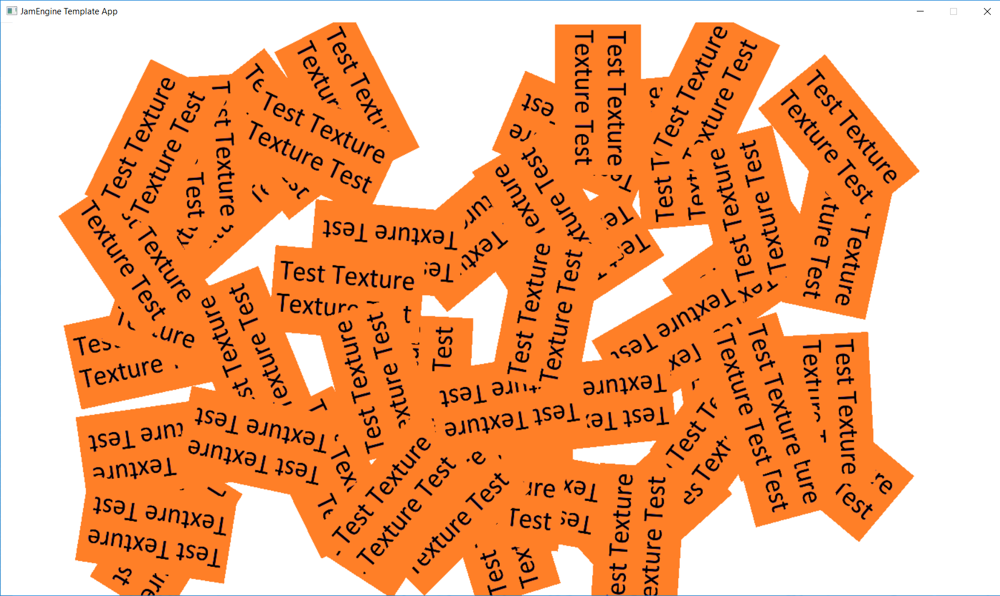

# JamEngine
C++ framework dedykowany do szybkiej budowy gier 2D podczas wydarzeń typu Game Jam.

JamEngine to autorski framework napisany w języku C++ z użyciem biblioteki SDL2, stworzony z myślą o umożliwieniu jak najszybszego tworzenia gier podczas Game Jamów lub innych zawodów opartych na szybkim tworzeniu oprogramowania.

Projekt oraz ta strona znajduje się w fazie dalszego rozwoju.

### Kontakt:
**Twórca:** Adrian Krzeszewski\
**E-mail:** krzeszewskiadrian@gmail.com

## Czym JamEngine różni się od innych rozwiązań?
JamEngine został napisany z myślą o jak najszybszym tworzenie oprogramowania. Wiele niepopularnych rozwiązań zostało w nim zaimplementowanych właśnie z tego powodu.
* JamEngine przewidziany jest do używania jako szkielet aplikacji, a nie zestaw dostarczonych metod.
  - Dostarczony kod jest napisany w prosty sposób, z metodami nie przekraczającymi zalecanego rozmiaru jednego ekranu i spełniającymi jedno zadanie lub powtarzalne zadania, jak inicjalizacja managerów.
  - Kod frameworku jest modułowy i łatwy do edycji.
* Możliwe jest określanie koordynatów jako wartość procentowa całej sceny. Obiekt o parametrach: 
{50.0, 50.0, 20.0, 20.0} umiejscowiony jest lewym górnym rogiem na środku swojego viewportu, i rozciąga się na kolejne 20% viewportu w prawo i w dół.
  - Jest to bardziej efektywny system przy szybkim budowaniu GUI - okazuje się bardziej intuicyjny i tworzy mniej błędów.
  - Dalej istnieje możliwość określania położenia obiektów za pomocą klasycznych jednostek.
* Animacje są dostarczane w formie folderu z kolejnymi klatkami animacji w formie obrazów. Obrazy muszą posiadać nazwę animacji z dodanym numerem klatki poprzedzonym zerami, uzupełniającymi liczbę do formatu 5 cyfrowego.
  - Podczas pracy z aplikacją PhotoShop wygenerowanie tak przygotowanych danych sprawdza się do jednego kliknięcia. Nie jest zaś możliwe wygenerowanie zbiorczej grafiki zawierającej kolejne klatki obok siebie.
* Dostarczony jest gotowy system viewportów połączonych z kamerami oraz warstw
  - Przyspiesza to budowę sceny.
  - Te same dane są jednocześnie wykorzystywane do determinowania obiektu klikniętego (obiekt na wierzchu stosu obiektów, jeśli nie zostało sprecyzowane inaczej).

 
## Funkcje
Framework posiada autorskie rozwiązania w obsłudze zadań:
* obsługa tekstur
* obsługa animacji
* podziałał obszaru aplikacji na niezależne viewporty
* system wielu kamer
* system dźwięków
* system czcionek
* obsługa klawiatury z edytowalnym przywiązaniem klawiszy do funkcji
* obsługa myszy
* zarządzanie ruchem obiektów
* system śledzenia progresu ładowania aplikacji
* system stałych powiązań animacji z dźwiękami
* system ukrytych nieregularnych obszarów

## Struktura systemów

Projekt został podzielony na systemy zarządzające w następujący sposób:


## Główne rozwiązania

### Managery oraz Time sensitive & Time insensitive

Pętla główna programu rozłożona jest na aktywność trzech głównym managerów:

* `LogicManager`
* `RenderManager`
* `SoundManager`

`LogicManager` zajmuje się obsługą logiki gry, za pomocą dwóch głównych metod:

* `calculateTimeInsensitive()`

* `calculateTimeSensitive()`

Wszystkie metody obsługujące logikę a **niepotrzebujące informacji o czasie jaki upłynął od ostatniej klatki gry** (jak np. sprawdzenie statusu obiektu) powinny zostać wywołane poprzez metodę `calculateTimeInsensitive()`, zaś wszystkie metody obsługujące logikę, **które potrzebują informacji o czasie jaki upłynął od ostatniej klatki gry** (jak np. odtworzenie animacji) powinny zostać wywołane poprzez metodę `calculateTimeSensitive()`.

Podział obsługi logiki aplikacji zależnie od czynnika czasu pozwala pobrać czas jaki upłynął od ostatniej klatki dopiero po przetworzeniu obliczeń niezależnych od czasu (czyli nieco później) i zarazem uzyskać nieco aktualniejszą pozycję do obliczeń logicznych oraz rysowania obiektów, a co za tym idzie - dokładniejszy obraz obszaru gry. 

### System rozkazów - order

Renderowanie wszelkich elementów graficznych oraz odtwarzanie dźwięków odbywa się w całości za pomocą rozkazów generowanych przez metody klasy `LogicManager` oraz metody pochodne i przesyłanych do klas renderujących grafikę i odtwarzających dźwięki. Wszystkie rozkazy przechowywane są w obiekcie klasy `LogicRaport`.

#### Manualne dodawanie rozkazów

Rozkazy wszystkich typów można dodać manualnie w podobny sposób:

**Rozkaz dla tekstury:**
```
RenderOrder testTexture(BACKGROUND, "test_texture", { 0, 0, 10, 10 }, 0, 100, GAME_MAIN);
	mLogicRaport->add(testTexture);
```
**Rozkaz dla animacji:**
```
RenderOrder testAnimation(FRONT, "test_animation", { 0, 0, 10, 10 }, 0, 100, GAME_MAIN, 0.03, &testOffset);
	mLogicRaport->add(testAnimation);
```
**Rozkaz dla tekstu:**
```
RenderOrder testText(GUI_FRONT, "tippa", {0, 0, 10, 10}, 0, 100, GAME_MAIN, 0.2, "Test text");
	mLogicRaport->add(testText);
```
**Rozkaz dla dźwięku:**
```
SoundOrder testSound("test_sound");
  mLogicRaport->add(testSound);
```
**Rozkaz dla ruchu kamery:**
```
CameraOrder testCamera(LOADING_MAIN);
	testCamera.jump(PanelManager.mList[LOADING_MAIN].getCameraX(), PanelManager.mList[LOADING_MAIN].getCameraY());
	mLogicRaport->add(testCamera);
```

`LogicRaport` jest automatycznie tworzony na początku nowego kroku managera `LogicManager`, a na zakończenie jego odpowiednie części: `RenderOrderPack`, `CameraOrderPack` i `SoundOrderPack` są przekazywane do właściwych managerów i obsługiwane zgodnie z zawieranymi rozkazami.

**Przykład:**
```
//Playing sound at the beginning
	if (frame == 1){
		SoundOrder testSound("test_sound");
		mLogicRaport->add(testSound);
	}
	//Rendering texture
	RenderOrder testTexture(BACKGROUND, "test_texture", { 10, 10, 20, 20 }, 0, 100, GAME_MAIN);
	mLogicRaport->add(testTexture);
	//Rendering animation
	RenderOrder testAnimation(FRONT, "test_animation", { 10, 40, 20, 20 }, 0, 100, GAME_MAIN, 0.01, &testOffset);
	mLogicRaport->add(testAnimation);
	//Rendering text
	RenderOrder testText(GUI_FRONT, "tippa", { 10, 70, 80, 20 }, 0, 100, GAME_MAIN, 1, "Test text");
	mLogicRaport->add(testText);

	//Moving camera from time to time
	if (frame % 200 == 0){
		CameraOrder testCamera(GAME_MAIN);
		testCamera.jump(rand() %50, rand() % 50);
		mLogicRaport->add(testCamera);
	}
```

Powyższy kod odgrywa dźwięk, dodaje statyczny obraz, dodaje animację, umieszcza na ekranie tekst w wybranej czcionce oraz cyklicznie losuje nową pozycję kamery.


#### Automatyczne dodawanie rozkazów

Głównym sposobem na dodawanie rozkazów renderowania jest dodawanie ich w sposób automatyczny. Odbywa się to poprzez tworzenie obiektów w taki sposób aby dziedziczyły po klasach bazowych umożliwiających konstrukcję rozkazu na podstawie danych obiektu. Po zgrupowaniu obiektów na odpowiednich listach możliwe jest automatyczne wygenerowanie rozkazów renderowania dla wszystkich obiektów ze wszystkich list. Dodawanie automatyczne rozkazów opiera się na klasach bazowych `Rednerable` i `Clickable` oraz klasach pomocniczych.

### Renderable

Obiekt przeznaczony do renderowania powinien dziedziczyć po klasie `Renderable`, która zawiera dane na temat położenia i stanu obiektu a także jego warstwy, viewportu czy widoczności. Automatyczne generowanie rozkazów jest możliwe jeśli obiekty znajdują się na liście stworzonej na bazie klasy `RenderableObjectsList`. Lista ta zapewnia że wszystkie obiekty na niej umieszczone znajdują się na tej samej warstwie i na tym samym viewporcie, co znacznie zmniejsza czas rysowania sceny.

Wskaźniki do wszystkich list z których mają zostać wygenerowane automatyczne rozkazy należy umieścić na wspólnej liście `RenderableLists`

`LogicManager` automatycznie dodaje wszystkie rozkazy renderowania do obiektu `LogicRaport`.

**Przykład:**
```
//Seting up new list
RenderableObjectsList testList(FRONT, GAME_MAIN);
mRenderableLists.add(&testList);

//Adding objects to list
for (int i = 0; i < 50; i++)
{
	testList.add(*(new TestObject(FRONT, "test_texture", 
	{ (double)(rand() % 80 + 5), (double)(rand() % 80 + 5), 15, 15 }, 0, rand()%360, GAME_MAIN)));
}
```

Powyższy kod dodaje do listy 50 różnych obiektów z losową pozycją i rotacją. W kolejnych kratkach są one, automatycznie renderowane bez udziału użytkownika.


	

### Clickable

Obiekty dziedziczące po klasie bazowej `Clickable` mogą być automatycznie dodawane do listy rozkazów renderowania tak samo jako obiekty `Renderable` za pomocą list `ClickableObjectsList` oraz wspólnej listy wskaźników `ClickableLists`.

Dodatkowo, obiekty dziedziczące po `Clickable` posiadają informacje o rozmiarze i kształcie pola do kliknięcia, oraz czy opcja klikania jest aktywna. Mogą więc posłużyć do automatycznego wykrywania klikniętego obiektu. Podczas determinowania klikniętego obiektu uwzględniane są viewporty oraz warstwy i wybierany jest element znajdujący się najwyżej w hierarchii, nie przykryty przez inne obiekty.

### Camera

Każdy stworzony viewport posiada własną kamerę. Pozycje wszystkich kamer są uaktualniane co klatkę, tuż przed rysowaniem sceny. Kamery mogą być sterowany za pomocą rozkazów jak zaprezentowane powyżej. Aktualnie dostępne są 3 typu manualnego sterowania kamerą. Możliwe jest dowolne ustawienie parametrów takich jak prędkość czy przyspieszenie, aby dopasować ruch kamery do swoich potrzeb. Na poprzednim gifie przedstawiono przemieszczanie kamery z pomocą natychmiastowego skoku `jump`. Pozostałe typu ruchów kamery to:

**slide:**

```
testCamera.slide(rand()%500  , rand()%500 );
```


**softSlide:**

```
testCamera.softSlide(rand()%500  , rand()%500 );
```


### InputManagment

Klasa InputManager zajmuje się kontrolą komunikatów otrzymywanych od użytkownika. Lista używanych kodów oznaczających unikalne intencje użytkownika powinna znaleźć się w enumie `inc`

**plik `InputCode.h`:**
```
#pragma once

//Input code enum 
enum inc
{
//Codes for all input actions used in app here:
	MOVE_UP = 0,
	MOVE_DOWN = 1,
};
```

Skonstruowanie domyślnego systemu sterowania odbywa się za pomocą metody `buildDefaultKeyCodesList()`.

```
void InputManager::buildDefaultKeyCodesList()
{
	///Bind keycodes here
	keyCodesList[SDLK_UP] = MOVE_UP;
	keyCodesList[SDLK_DOWN] = MOVE_DOWN;
}
```

W każdej klatce automatycznie tworzona jest lista kodów uzyskanych na podstawie wciśniętych klawiszy, a także uaktualniany jest obiekt nad którym znajduje się kursor myszy oraz informacja o stanie klawisza myszy. Informacje te można łatwo otrzymać z klasy `LogicManager`.


## Struktura katalogów zasobów:


